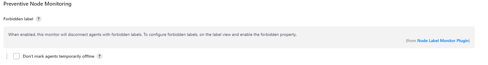
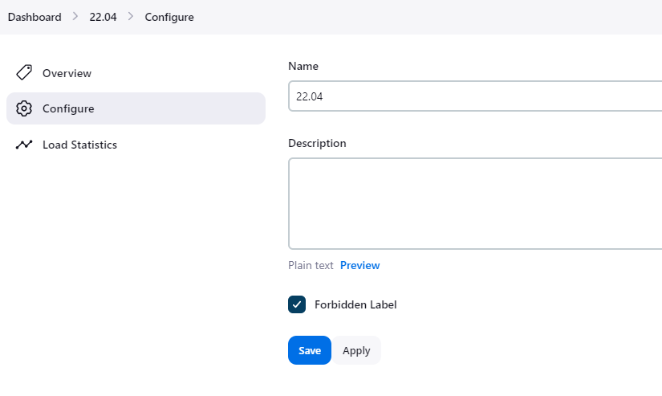
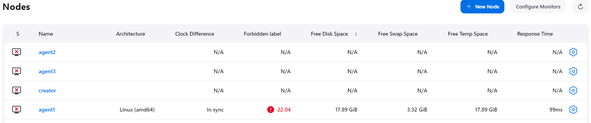
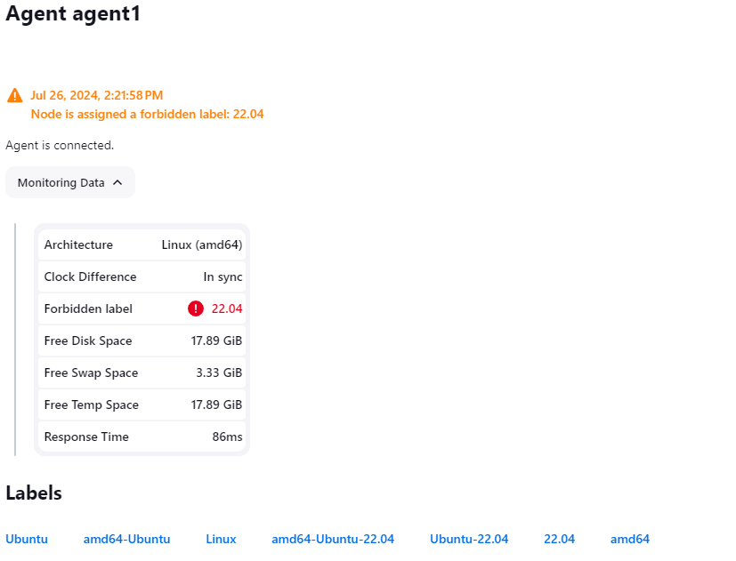

# node-label-monitor-plugin

## Introduction

Node Label Monitor Plugin add a new Node Monitor to Jenkins that will check if a node is matching a label and disconnect if needed.

This is typically used by plugins like `platformlabeler` when labels are automatically assigned to nodes.

Like all other node monitor the disconnect option can be enabled or disabled on the node monitor configuration.



## Getting started

When creating a new label on Jenkins you can associate a property to it. This property will be used by the `Node Label Monitor Plugin` to check if the node is matching the label.

The most convenient way to create a label to to use JCasC (Jenkins Configuration as Code) and create a new label with the following configuration:

```yaml
jenkins:
  labelAtoms:
  - name: "24.04"
  - name: "Linux"
  - name: "Ubuntu"
  - name: "Centos-7"
    properties:
    - "forbiddenLabel"
```

If those labels already exists on your jenkins instance you navigate to /nodes, select a label and select 'configure'

From there you can add a new property to the label:



The plugin add a new column with the label that was forbidden





## Contributing

Node Label Monitor Plugin  review the default [CONTRIBUTING](https://github.com/jenkinsci/.github/blob/master/CONTRIBUTING.md) file and make sure it is appropriate for your plugin, if not then add your own one adapted from the base file

Refer to our [contribution guidelines](https://github.com/jenkinsci/.github/blob/master/CONTRIBUTING.md)

## LICENSE

Licensed under MIT, see [LICENSE](LICENSE.md)

